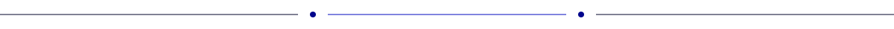

	<picture>
		<source srcset="static/logo-dark.svg" media="(prefers-color-scheme: dark)"/>
		
	</picture>

<picture >
	<source srcset="out/header-dark.svg" media="(prefers-color-scheme: dark)">
	
</picture>
<picture >
	<source srcset="static/separator-dark.svg" media="(prefers-color-scheme: dark)">
	
</picture>
<picture >
	<source srcset="out/projects-dark.svg" media="(prefers-color-scheme: dark)">
	
</picture>

<a href="https://lastfm-viewer.vercel.app/">
	<picture >
		<source srcset="out/@lastfm-viewer-dark.svg" media="(prefers-color-scheme: dark)">
		
	</picture>
</a>

<picture >
	<source srcset="static/separator-dark.svg" media="(prefers-color-scheme: dark)">
	
</picture>
<picture >
	<source srcset="out/reach-me-dark.svg" media="(prefers-color-scheme: dark)">
	
</picture>

<a href="https://zoasr-portfolio.pages.dev/">
	<picture >
		<source srcset="out/website-dark.svg" media="(prefers-color-scheme: dark)">
		
	</picture>
</a>
<a href="https://www.linkedin.com/in/zeyad-sherif/">
	<picture >
		<source srcset="out/linkedin-dark.svg" media="(prefers-color-scheme: dark)">
		
	</picture>
</a>
<a href="https://github.com/zoasr">
	<picture >
		<source srcset="out/github-dark.svg" media="(prefers-color-scheme: dark)">
		
	</picture>
</a>

