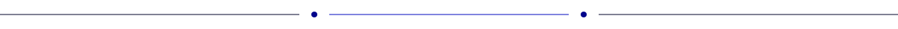

<picture >
	
</picture>
<picture >
	
</picture>
<picture >
	
</picture>

<picture >
	
</picture>

<picture >
	
</picture>
<picture >
	
</picture>

<a href="#">
	<picture >
		
	</picture>
</a>
<a href="https://www.linkedin.com/in/zeyad-sherif/">
	<picture >
		
	</picture>
</a>
<a href="https://github.com/zoasr">
	<picture >
		
	</picture>
</a>

